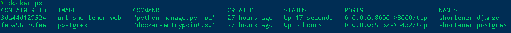
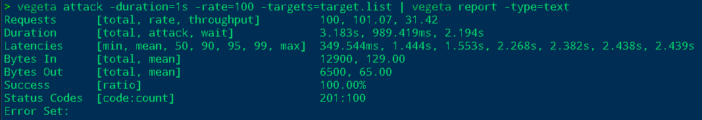

# HTTP сервис для сокращения URL

Сервис имеет следующие возможности:
- сохранять короткие представления заданного URL;
- переходить по сохраненному ранее короткому представлению и получать 
  redirect на соответствующий исходный URl;
- валидация URL с проверкой корректности ссылки;
- задавать кастомные ссылки, чтобы пользователь мог сделать их 
  человекочитаемыми

Сервис имеет простой UI, доступный по адресу [http://188.68.222.219:8000/](http://188.68.222.219:8000/)

## API методы

### Создать короткую ссылку с дефолтной хешем

Запрос с помощью `curl`:

```shell
curl --header "Content-Type: application/json" \
  --request POST \
  --data '{"long_url": "your_url"}' \
  http://188.68.222.219:8000/api/v1/create/
```

Запрос с помощью `httpie`:

```shell
http POST 188.68.222.219:8000/api/v1/create/ long_url=your_url
```

Ответ:
- `long_url` — исходный URL;
- `short_url` — созданная укороченная ссылка;
- `url_hash` — автоматически сгенерированный хеш;

Или описание ошибки.

### Создать короткую ссылку с кастомным хешем

Запрос с помощью `curl`:

```shell
curl --header "Content-Type: application/json" \
  --request POST \
  --data '{"long_url": "your_url", "url_hash": "your_custom_link"}' \
  http://188.68.222.219:8000/api/v1/create/
```

Запрос с помощью `httpie`:

```shell
http POST 188.68.222.219:8000/api/v1/create/ long_url=your_url url_hash=your_custom_link
```

Ответ:
- `long_url` — исходный URL;
- `short_url` — созданная укороченная ссылка;
- `url_hash` — ваша кастомная ссылка;

Или описание ошибки.

## Как установить сервис локально

### Быстрый старт

Самый быстрый способ запустить сервис - запустить его с использованием базы данных SQLite:

- Скачайте код:
```shell
git clone https://github.com/Alex-Men-VL/url_shortener.git
cd url_shortener
```
- Создайте виртуальное окружение:
```shell
python3 -m venv env
sourve env/bin/activate
```
- Установите зависимости:
```shell
pip install -r requirements.txt
```
- Создайте `.env` файл в корне проекта со следующими настройками (все настройки опциональны и для локального запуска 
  не требуются). Формат записи `ПЕРЕМЕННАЯ=значение`:
  - `DEBUG` — дебаг-режим. По умолчанию `False`;
  - `SECRET_KEY` — секретный ключ проекта.  Не стоит использовать значение по-умолчанию, **замените на своё**;
  - `ALLOWED_HOSTS` — [см. документацию Django](https://docs.djangoproject.com/en/3.1/ref/settings/#allowed-hosts).
  - `HOST_NAME` — хост сервера, на котором запущен сервис. По умолчанию `http://127.0.0.1:8000/`.
- Накатите миграции базы данных:
```shell
python3 manage.py migrate
```
- Запустите сервис командой:
```shell
python3 manage.py runserver
```

UI доступен по ссылке [http://localhost:8000/](http://localhost:8000/).

Для использования API методов, замените `http://188.68.222.219:8000/api/v1/create/` на 
`http://localhost:8000/api/v1/create/`.

### Локальный запуск используя docker-compose

- Создайте `.env` файл в корне проекта с настройками из предыдущего пункта. Добавьте к ним следующую настройку:
```shell
DATABASE_URL=postgres://postgres:postgres@db:5432/url_shortener
```
- Запустите сервис `Django` и `Postgres` следующей командой:
```shell
docker-compose up -d --build
```
- Накатите миграции:
```shell
docker-compose run web python manage.py migrate
```
- Проверьте статус созданных контейнеров:
```shell
docker ps -a
```

Вывод должен быть следующего формата:



- При наличии ошибок, проверьте логи:
```shell
docker logs <name из столбца NAMES>
```

UI доступен по ссылке [http://localhost:8000/](http://localhost:8000/).

Для использования API методов, замените `http://188.68.222.219:8000/api/v1/create/` на 
`http://localhost:8000/api/v1/create/`.

## Выполнены следующие усложнения

- Написаны тесты;
- Добавлена валидация URL с проверкой корректности ссылки;
- Добавлена возможность задавать кастомные ссылки;
- Проведено нагрузочное тестирование с целью понять, какую нагрузку на чтение может выдержать наш сервис:



Было выполнено 100 запросов за 3s без ошибок. В 1s сервис обрабатывает около 30 запросов.

## Цель проекта

Код написан в образовательных целях на онлайн-курсе для веб-разработчиков [dvmn.org](https://dvmn.org/).
